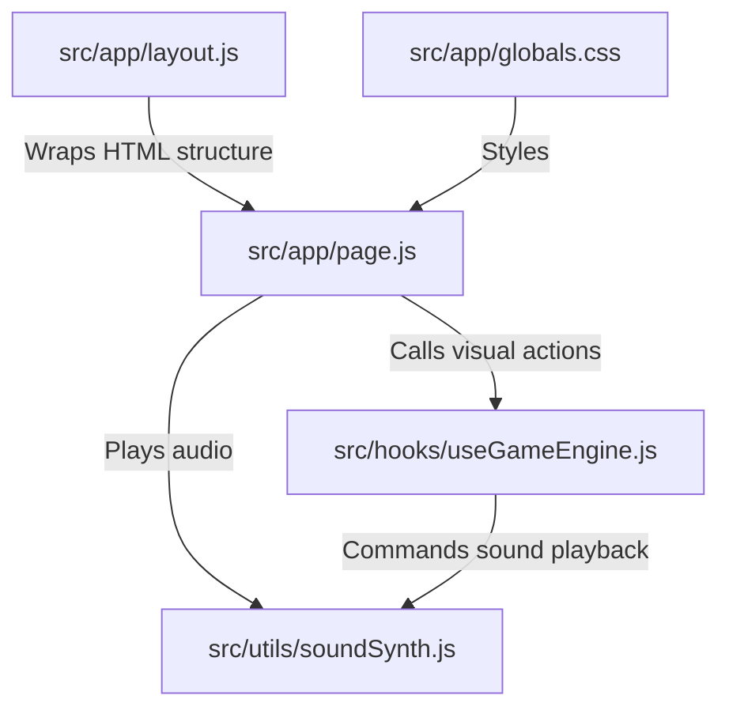

# 🌙 Celestial Cycles: Codebase & Architecture Guide (Non-Technical Explanation)

Welcome to the **Celestial Cycles** codebase! If you are a non-technical person, a designer, or a curious player looking to understand how this game works under the hood, this document is for you.

To make this easy to understand, let's imagine this game as a **theater production**:
*   **The Stage & Actors (`page.js`)**: What the audience sees, how they interact, and how things move.
*   **The Director & Rulebook (`useGameEngine.js`)**: The brain that keeps track of the score, decides whose turn it is, and makes sure players follow the rules of the cosmos.
*   **The Sound Designer (`soundSynth.js`)**: The dynamic orchestra that synthesizes starry background hums and magical sound effects on the fly.
*   **The Decor & Costumes (`globals.css`)**: The colors, glowing borders, fonts, and dark space aesthetics that make the stage look premium.

---

## 📂 File-by-File Breakdown

Here is a map of the project files, where they live, and exactly what job they do:

### 1. 🎭 `src/app/page.js` (The Visual Stage)
*   **What it is:** The visual layout of the game. It draws the menus, buttons, cards, boards, and scoreboards onto the screen.
*   **What it does:**
    *   **Controls Drag-and-Drop:** It lets you grab a lunar card from your hand and drop it onto the grid.
    *   **Animates Everything:** Powered by a library called *Framer Motion*, this file handles the cards flying into your hand, the board tiles flipping when captured, wildcard meteors vaporizing tiles, and screens fading in and out.
    *   **Renders the Moon Graphics:** It draws high-fidelity custom SVG moons (using mathematical lines, craters, and 3D shadows) representing each phase (New Moon, Crescents, Quarters, Gibbous, and Full Moon).
    *   **Connects Combos:** It physically draws glowing lines between matching moon tiles on the grid so you can see your pairs or cycles light up.

### 2. 🧠 `src/hooks/useGameEngine.js` (The Game Master & AI)
*   **What it is:** The mathematical heart and state-manager of the game. It knows nothing about graphics; it only cares about numbers, lists, grids, and rules.
*   **What it does:**
    *   **Keeps Game State:** It knows the current level, whose turn it is (Player or AI), how many cards are left in the deck, and what the scores are.
    *   **Enforces the Rules:** When you place a card, it checks:
        *   *Are these two identical moons next to each other?* (Pair - **0.5 points**)
        *   *Are they opposites that make a Full Moon?* (Full Moon Pair - **2 points**)
        *   *Are they 3 or more in a consecutive sequence?* (Lunar Cycle - **1 point per card**)
    *   **Manages Grid Ownership:** It tracks which player owns which grid tile, turning them Gold for the player and Purple for the AI.
    *   **Acts as the AI ("The Half Moon"):** It calculates the best possible moves for the computer player, lets the AI choose cards, and updates the AI's facial expressions (sleeping, thinking, shocked, happy, or sad) depending on what happens.
    *   **Casts Cosmic Spells (Wildcards):** It processes your special spells:
        *   *Equinox:* Swaps scores between you and the AI.
        *   *Supermoon:* Multiplies your scores.
        *   *Eclipse:* Captures neighboring tiles.
        *   *Meteor:* Destroys a card on the grid.

### 🔊 3. `src/utils/soundSynth.js` (The Sound Designer)
*   **What it is:** A dynamic sound synthesizer. Instead of downloading heavy, slow audio files (like `.mp3` or `.wav`), it creates sound waves directly in your web browser using code!
*   **What it does:**
    *   **Bypasses Autoplay Restrictions:** Web browsers prevent sites from playing audio automatically. This file listens for your very first click on the page and "auto-unlocks" the audio engine immediately.
    *   **Creates the Cosmic Space Drone:** Generates a deep, warm ambient hum (using two oscillating waves detuned slightly to create a breathing "binaural beat") so you feel like you are floating in space. It runs through a low-pass filter so it is clearly audible on laptops and mobile devices.
    *   **Synthesizes Sound Effects:**
        *   *Clicks:* A soft wooden click when you tap buttons.
        *   *Hovers:* A soft high-pitched sweep when you select cards.
        *   *Combo Scores:* A beautiful, ascending major 7th chord chime when you make matches.
        *   *Win/Lose Chimes:* Rewarding scales or dark, low-pitched sweeps when a round concludes.
        *   *Wooshes:* Air-like sound waves when cards flip.

### 🎨 4. `src/app/globals.css` (The Costume Designer)
*   **What it is:** The style stylesheet. It holds all the colors, fonts, margins, sizes, and decorative glows.
*   **What it does:**
    *   **Defines the Cosmic Color Palette:** Stores CSS variables for deep space purples, gold neon stars, orbital paths, and glassmorphic panels.
    *   **Applies Glassmorphism:** Gives panels a frosted-glass look with blurred backgrounds, semi-transparent gold borders, and floating shadows.
    *   **Applies Custom Fonts:** Sets up clean, modern typography (like *Geist Sans* and *Geist Mono*) for a premium, clean look.
    *   **Handles Screen Sizes:** Ensures the cards, grids, and scoreboard rearrange themselves beautifully on wide desktop monitors, tablet screens, and small smartphones.

### 🖼️ 5. `src/app/layout.js` (The Frame)
*   **What it is:** The outermost container of the application.
*   **What it does:**
    *   Injects the global fonts and CSS stylesheets.
    *   Sets up metadata for search engines (SEO) like the page title ("Celestial Cycles - Rise of the Half Moon") and site description.

---

## 🛠️ Configuration & Housekeeping Files
Located in the project root, these files configure the environment rather than run the game:
*   **`package.json`**: The manifest listing the external libraries (like React, Next.js, and Framer Motion) required to run and build the project.
*   **`next.config.mjs`**: Tells Next.js how to compile and run the server.
*   **`eslint.config.mjs`**: A code-checker configuration that helps developers catch formatting bugs and errors before saving.
*   **`jsconfig.json`**: Helps the code editor understand folder pathways (e.g. mapping files with `@/*` shortcuts).

---

## 🚀 How the Flow Works Together
1.  You open the website. The page loads (`layout.js` inside `page.js`).
2.  `page.js` loads the main menu and triggers the sound engine (`soundSynth.js`). The sound engine waits for you to click.
3.  You click **"Enter Orbit (Play)"**. The audio engine unlocks, playing the cosmic ambient drone and a wooden click.
4.  The visual screen changes to the game layout (`page.js`), fetching data from the game brain (`useGameEngine.js`).
5.  You drag a card onto the board. The game brain evaluates if you formed a pair, full moon, or cycle.
6.  If you did, the game brain adds points to your score, tells the visual layer to flash glowing lights and lines (`page.js`), and calls the sound engine to play a celestial chord chime (`soundSynth.js`).
7.  The game brain switches turn to the AI, which decides its move and plays it.
8.  Once the grid is full, the game calculates final scores, plays a Win/Lose chime, and lets you advance to the next level!
